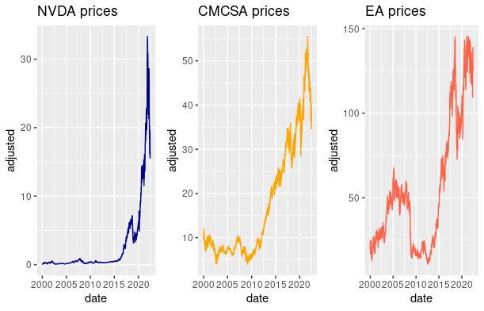

# 📈 Portfolio Analysis of NVDA, CMCSA, and EA Stocks

**Author:** Paul Muriithi  
**Date:** 2022-06-18  
**Tools Used:** R (tidyquant, ggplot2, broom, e1071)
**Data Source:** [Tiingo API](https://www.tiingo.com/)

---

## 🔍 Objective

This project explores the investment behavior and risk-return profile of three U.S. stocks — **NVIDIA (NVDA)**, **Comcast (CMCSA)**, and **Electronic Arts (EA)** — from 2000 to mid-2022. It examines:

- Return characteristics and distribution
- Correlation structure
- T-test validations
- Portfolio optimization
- Response to major financial events

---

## 1️⃣ Price Movements

The stocks show diverse trajectories:

- **NVDA** grew exponentially, especially after 2016.
- **CMCSA** exhibited steady but less volatile growth.
- **EA** fluctuated with moderate gains and cyclical volatility.

📊 *[See Price Trends]*  

---

## 2️⃣ Daily Returns Behavior

Log returns were computed to capture the daily percentage movement.

Key insights:

- **NVDA** returns were the most volatile.
- All three stocks displayed **non-normal return distributions** — characterized by fat tails (kurtosis) and skewness.

📊 *[See Return Plots]*  

---

## 3️⃣ Distribution of Returns

Histograms show that the return distributions for NVDA, CMCSA, and EA are approximately symmetric and bell-shaped, suggesting they are close to normal. However, their sharp peaks and heavy tails indicate leptokurtosis, meaning:

Returns cluster tightly around the mean

Occasional large jumps (both positive and negative) occur

Higher likelihood of extreme events compared to normal distributions

📊 *[See Histograms]*  

4️⃣ Statistical Profile (Summary)
Below is a condensed summary of key return metrics:

Stock	Mean Return	Std Dev	Skewness	Kurtosis	Risk Level	Profile
NVDA	0.0916%	3.78%	-0.254	13.4	High	High risk, high return
CMCSA	0.0208%	2.05%	-0.0116	8.27	Low	Low risk, low return
EA	0.0289%	2.60%	0.125	6.40	Moderate	Balanced

Interpretation:

📈 NVDA: Offers the highest potential return, but comes with the most volatility and extreme tail events.

🛡️ CMCSA: Least risky; returns are stable, but modest.

⚖️ EA: Sits in between — a compromise between risk and reward.

---

## 5️⃣ Are Returns Statistically Significant?

A t-test on daily returns against zero mean showed that:

- **None of the stocks had significantly non-zero daily returns** at the 99% level.
- This supports the **Efficient Market Hypothesis (EMH)**, suggesting stock prices incorporate all available information.

---

## 6️⃣ How Do These Stocks Compare?

Pairwise tests of means suggest:

- **CMCSA and EA** differ meaningfully in return behavior.
- **NVDA**, although more volatile, does not have a statistically distinct mean return from the others.

Conclusion: Risk preferences, not average returns, define their uniqueness.

---

## 7️⃣ Correlation and Diversification

All stocks are **moderately positively correlated**, meaning:

- Returns tend to move in the same direction, but not perfectly.
- There’s room for **diversification**, but it’s limited.

📊 *[See Correlation Heatmap]*  

---

## 8️⃣ Optimal Portfolio Combinations

Using a custom "happiness" metric (Expected Return − Variance), three 2-stock portfolios were optimized:

| Portfolio        | Best Use Case                  |
|------------------|-------------------------------|
| **CMCSA + EA**   | Low volatility, stable growth |
| **NVDA + EA**    | Higher potential return       |
| **NVDA + CMCSA** | Risk-balanced combination     |

The best option depends on investor appetite:
- Risk-averse? → CMCSA + EA  
- Growth-focused? → NVDA + EA

---

## 9️⃣ Impact of Global Events

Using regression, we examined the effect of two key events:

- **Lehman Brothers Collapse (2008)**
- **COVID-19 WHO Announcement (2020)**

Findings:

- **NVDA** was most affected by the Lehman event.
- **CMCSA** showed a marginal drop during Lehman but less in the pandemic.
- **EA** proved the most resilient, with neither event significantly affecting daily returns.

📉 Interpretation: EA may serve as a **defensive stock** during crises.

---

## 🔚 Conclusion

This analysis supports the idea that:

- Portfolio construction should match an investor's **risk tolerance**.
- High-return assets like NVDA come with significant volatility.
- CMCSA and EA offer **diversification and downside protection**.
- External shocks like financial crises affect different stocks in varying degrees.

---

## 📁 Project Structure

